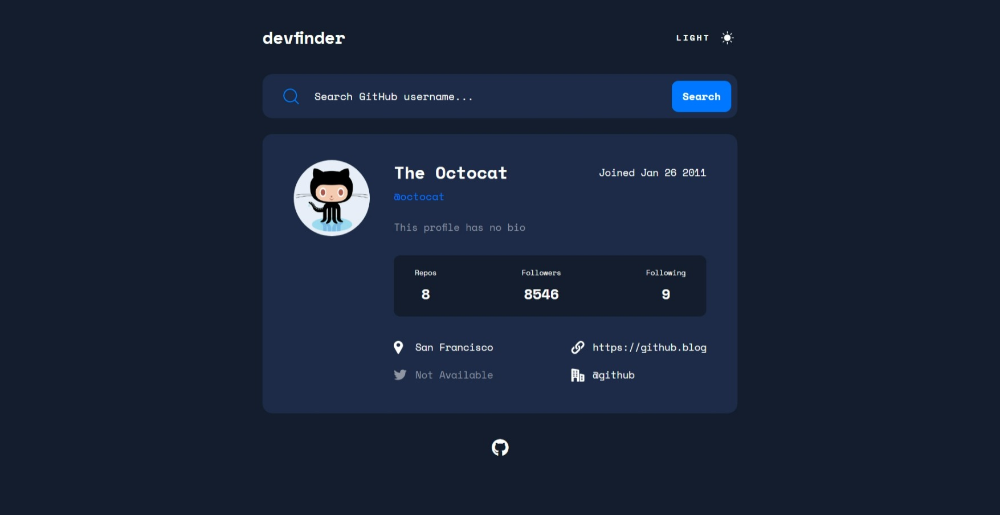

# GitHub User Search App

## Links:
- [Challenge Link](https://www.frontendmentor.io/challenges/github-user-search-app-Q09YOgaH6)
- [Site Preview](https://robinjmm-ghsa.vercel.app/)

## About
This is my solution for the GitHub User Search App challenge from [Frontendmentor.io](https://frontendmentor.io).

## User Stories
The user should be able to:
- View the optimal layout for the app depending on their device's screen size
- See hover states for all interactive elements on the page
- Search for GitHub users by their username
- See relevant user information based on their search
- Switch between light and dark themes

## Built with
- HTML5
- CSS3
- SASS
- PostCSS
- JavaScript
- Vite

## Acknowledgement
I'm very grateful to the people at [Frontendmentor.io](https://frontendmentor.io) for providing designs and challenges that help me improve my skills as a web developer.
